# ASP NET Core 9 : Microservices y Event Driven Architecture

Construye Microservices con arquitecturas avanzadas usando Event Sourcing Postgres MongoDB y Apache Kafka

## Qué aprenderás?

Dominarás patrones, técnicas y tecnologías clave como:

- Event-Driven Architecture
- Event Sourcing
- CQRS (Command and Query Responsibility Segregation)
- Domain-Driven Design para modelado avanzado de entidades y Value Objects
- Generic Repository e IUnitOfWork aplicados correctamente
- Integración completa con Docker Compose para MongoDB, Apache Kafka y PostgreSQL
- Manejo avanzado de transacciones con DbContext Factory
- Procesos y transacciones en segundo plano con Entity Framework
- FluentValidation en escenarios reales
- Middleware y manejo global de excepciones en .NET
- Creación de microservicios a nivel profesional
- Y muchos temas adicionales orientados a arquitecturas distribuidas

## Event-Driven Architecture: La base

Uno de los mayores retos dentro de una arquitectura de microservicios es garantizar una comunicación confiable entre servicios sin generar acoplamientos innecesarios.

Aquí es donde surge el paradigma de Event-Driven Architecture.

En una arquitectura basada en eventos:

- Los microservicios no se comunican directamente entre ellos.
- Cada servicio publica eventos cuando ocurre algo relevante en su contexto.
- Otros servicios consumen esos eventos y reaccionan según su propia lógica.

Esto crea un sistema descentralizado, escalable y resiliente, capaz de evolucionar sin afectar a los demás servicios.

## Conclusión

Si deseas aprender cómo se construyen realmente los microservicios en el mundo profesional, este curso te llevará paso a paso a implementar una arquitectura moderna basada en eventos, integrando herramientas esenciales y resolviendo escenarios complejos del día a día en empresas de alto nivel.

## Proyectos y Bases de Dato

**Event-Driven Architecture**

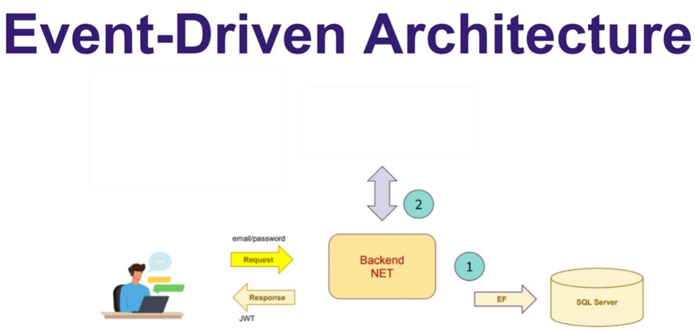

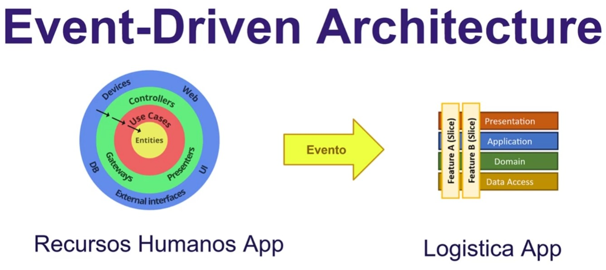

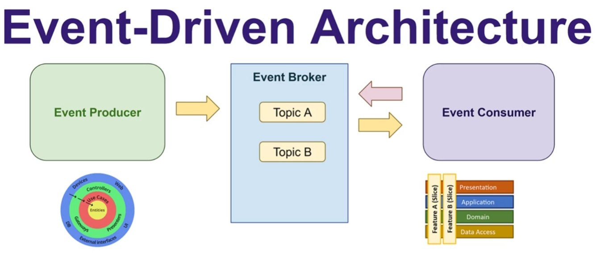

**Event Sourcing**

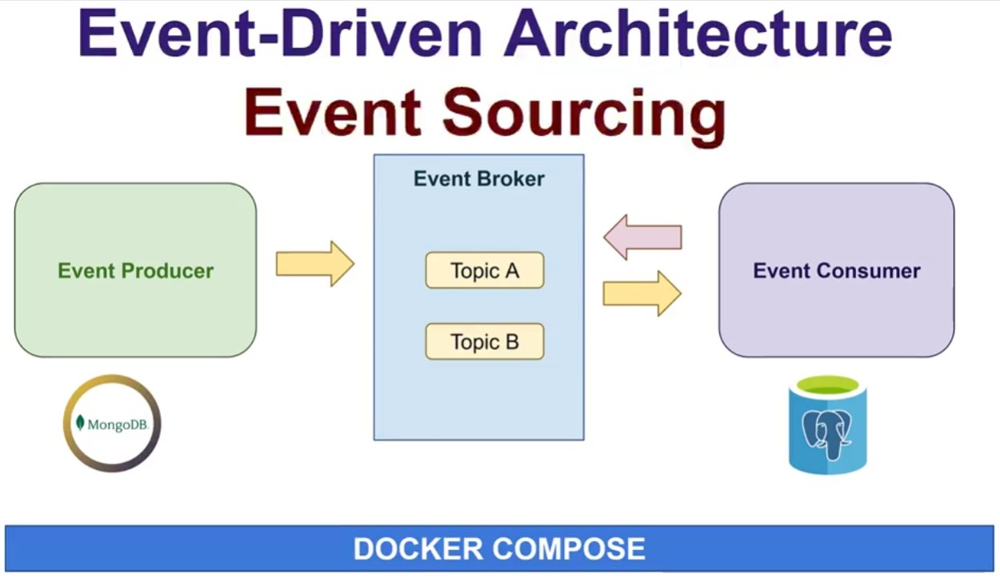

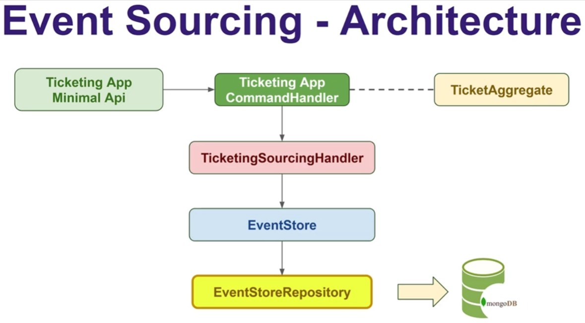

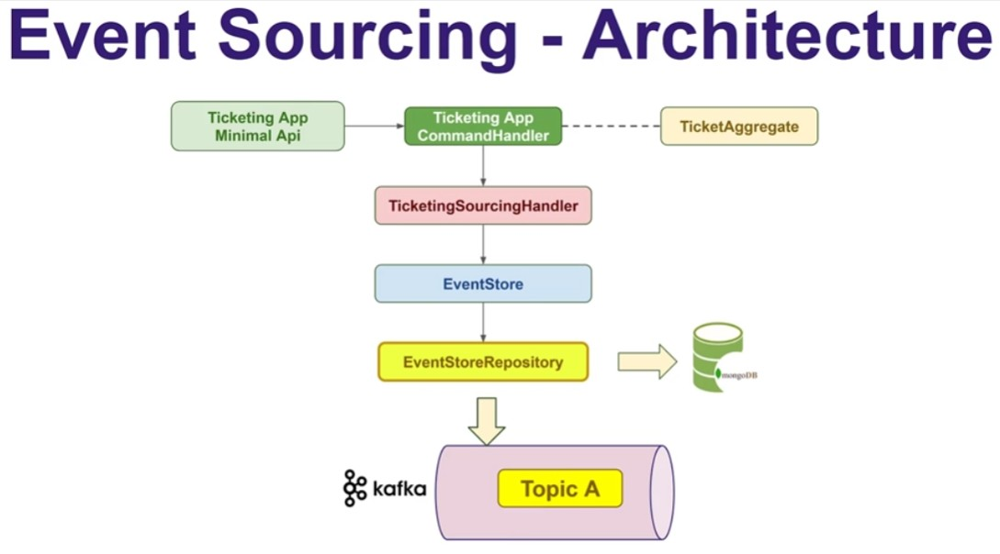

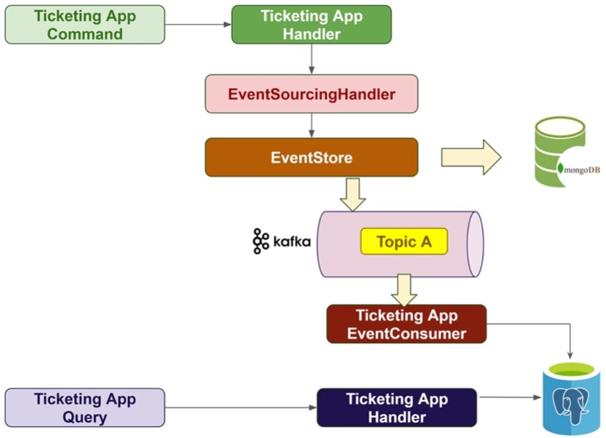

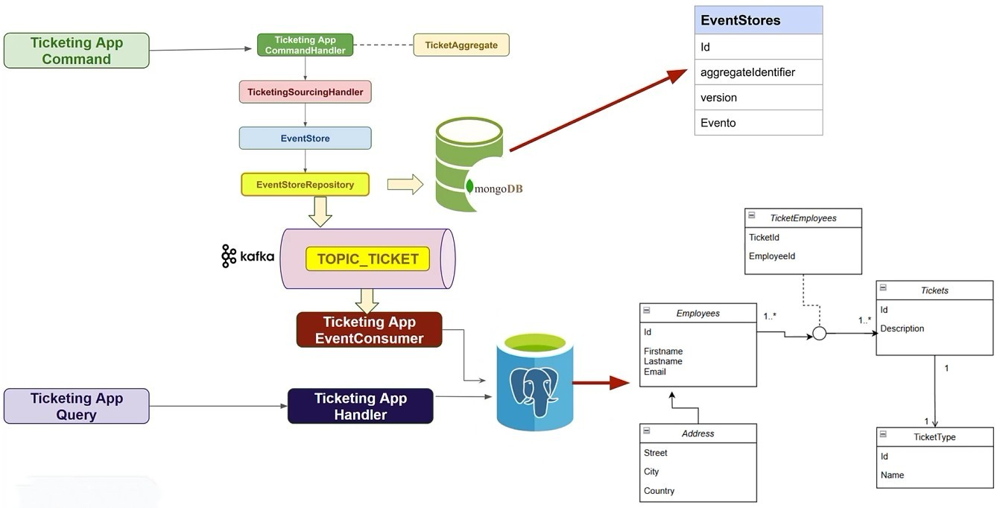

**Comunicacion Datos**

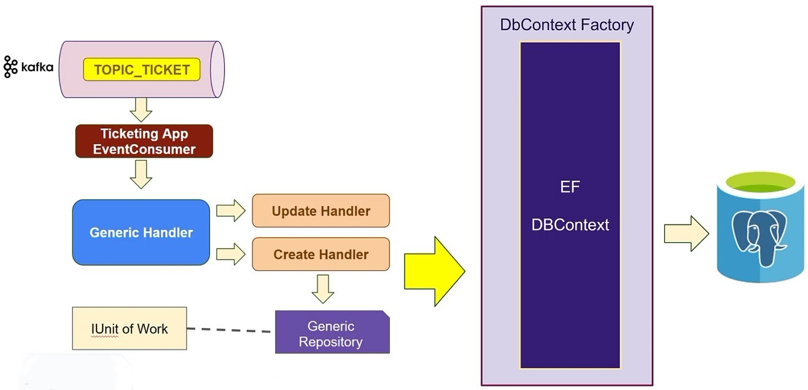

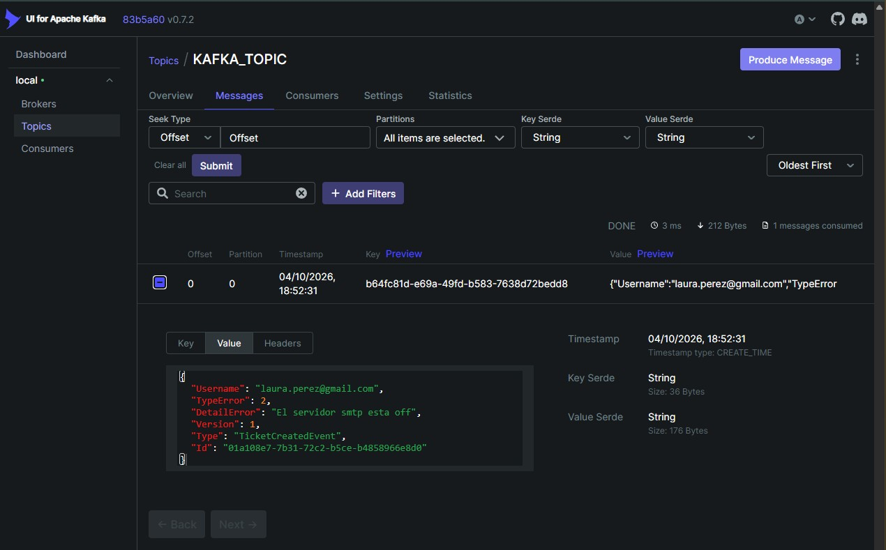

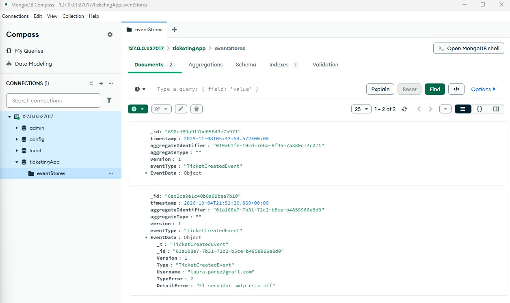

